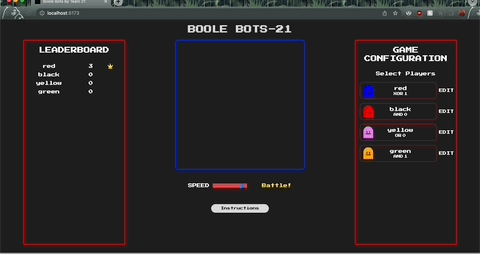

# Boolebots by Team 21

[Live App](https://boolebots21.netlify.app/)<br>
[Project Source](https://github.com/chingu-voyages/voyage-project-tier2-boolebots)



## Description

Boole Bots is a game that is not only fun, but also an aid in helping to understand basic Boolean logic. This game has an arena of 8x8 game tiles in which your bots move at random speeds and trajectories. The Bots are assigned boolean values of 0 or 1 and boolean operations - AND, OR, NOR, XOR.

## Authors

- Jacob Benson - [Github](https://github.com/bensonbjacob) || [LinkedIn](https://www.linkedin.com/in/jacob-benson-885004240/)
- Hope Magat - [Github](https://github.com/jezraelhope) || [LinkedIn](https://www.linkedin.com/in/jezraelhope/)
- Juan Guzman - [Github](https://github.com/Pi-face) || [LinkedIn](https://www.linkedin.com/in/juan-guzman-/)

## Table of Contents

- [Team Vision Statement](#team-vision-statement)
- [Tech Used](#tech-used)
- [Game Logic](#)
- [Project Installation](#project-installation)
- [Usage](#usage)
- [How to Play](#how-to-play)
- [Credits](#chingu-credits)

## Team Vision Statement

To create an interactive game that will aid in understanding boolean logic using icons as bots that will play in an 8x8 arena.

## Tech Used

This project was created using **React**, **JavaScript**, **TailwindCSS**, and **HTML Canvas** for the animation.

## Game Logic

Each bot is assigned a boolean value and an operation. When 2 bots collide, their boolean value and their opponent's boolean value are compared using each of their assigned operation. This gives a different result each time a bot collides with a different bot. The result is then compared amongst each other and whoever has 1 wins, 0 loses and if their results are the same, it should result in a tie.<br>
<br>
**An example of a game of 4 players with varying operation:**<br>
<br>
| Players | Operation | Boolean |
|---------|-----------|---------|
| 1 | AND | 1 |
| 2 | XOR | 1 |
| 3 | NOR | 0 |
| 4 | OR | 0 |

### **Player 1 vs Player 2**

|         | Boolean | Operation | Opponent's Boolean | Result   |
| ------- | ------- | --------- | ------------------ | -------- |
| Player1 | 1       | AND       | 1                  | 1 - WIN  |
| Player2 | 1       | XOR       | 1                  | 0 - LOST |

### **Player 1 vs Player 3**

|         | Boolean | Operation | Opponent's Boolean | Result   |
| ------- | ------- | --------- | ------------------ | -------- |
| Player1 | 1       | AND       | 1                  | 1 - WIN  |
| Player3 | 0       | NOR       | 1                  | 0 - LOST |

### **Player 1 vs Player 4**

|         | Boolean | Operation | Opponent's Boolean | Result  |
| ------- | ------- | --------- | ------------------ | ------- |
| Player1 | 1       | AND       | 1                  | 1 - tie |
| Player4 | 0       | OR        | 1                  | 1 - tie |

### **Player 2 vs Player 3**

|         | Boolean | Operation | Opponent's Boolean | Result   |
| ------- | ------- | --------- | ------------------ | -------- |
| Player2 | 1       | XOR       | 0                  | 1 - win  |
| Player3 | 0       | NOR       | 1                  | 0 - lost |

### **Player 2 vs Player 4**

|         | Boolean | Operation | Opponent's Boolean | Result  |
| ------- | ------- | --------- | ------------------ | ------- |
| Player2 | 1       | XOR       | 0                  | 1 - tie |
| Player4 | 0       | OR        | 1                  | 1 - tie |

### **Player 3 vs Player 4**

|         | Boolean | Operation | Opponent's Boolean | Result   |
| ------- | ------- | --------- | ------------------ | -------- |
| Player3 | 0       | NOR       | 0                  | 1 - win  |
| Player4 | 0       | OR        | 0                  | 0 - lost |

## Project Installation

To run this application on your local system, follow these steps:

1.  Ensure you have Node.js installed. You can download it from [https://nodejs.org](https://nodejs.org).

2.  Clone this repository to your local machine using the following command:

    ```bash
    git clone https://github.com/chingu-voyages/v44-tier2-team-21.git

    ```

3.  Navigate to the project's root directory:

    ```bash
    cd v44-tier2-team-21

    ```

4.  Install the project dependencies using npm or Yarn:

    ### Using Npm

        npm install

    ### Using Yarn

        yarn

## Usage

Once you have completed the installation steps, you can run the application locally by following these instructions:

    npm start

## How to Play

1.  Add bots by entering a name, a color, and then selecting
    their boolean value, initial direction of movement, and
    their opertation. You can add up to four bots.
2.  Select the bots you wish to play by clicking on them in the
    list.
3.  Press the Battle! button to begin the match.

## Chingu Credits

This collaboration is made possible by [Chingu Voyages](https://www.chingu.io/).
